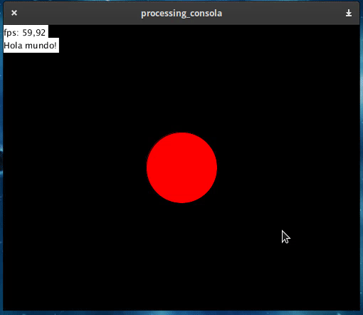
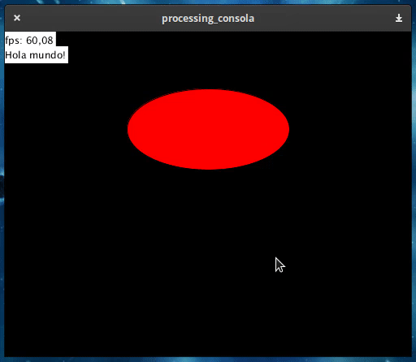

# Consola

Esta es una consola que facilita la impresion de datos y alertas sobre la pantalla. Además, cuenta con una terminal que se abre al presionar la tecla F1. Se pueden agregar facilmente comandos para calibrar cosas en tiempo de ejecución.

## Ejemplo

El sketch viene con una elipse lista para calibrar su tamaño, posicion y color.

